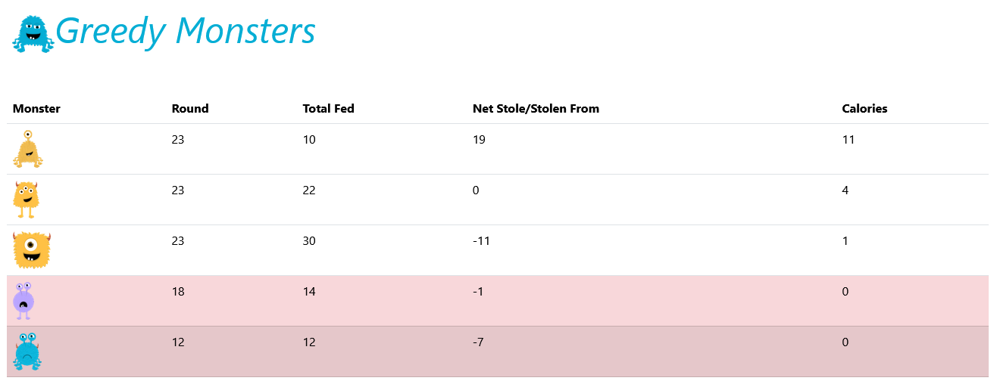
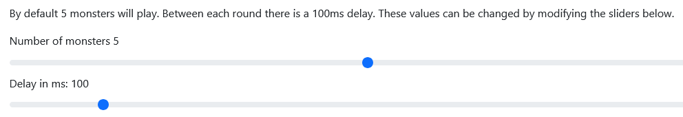
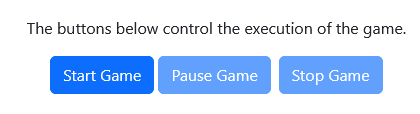

## Game Description

Greedy Monsters is a zero-player game in which a set number of monsters compete for calories.

When a monster has no calories left, it is dead. The last monster left is the winner of the game.

Each monster get 5 calories at the start of the game. The monsters will take turns in a round competing for calories. For each round, the following steps will be performed for each monster:

1. A monster awakens and consumes one calorie. 
2. It is fed with an arbitrary number of calories between 1 and 3. 
3. There is a 20% chance that these calories are toxic. If so, they are subtracted from the monster's calories. 
4. There is a 50% chance that this monster will steal half the calories of another sleeping monster. Only one monster can steal for in each round.
5. The monster goes back to sleep.

When a new round starts, the monster with the least calories will wake up first.

### Configuration
The following parameters can be configured:

- The number of monsters playing. Can be between 3 and 8. Default is 5.
- The time in ms between each round. Can be between 0 and 1000. Default is 100ms.
  This parameter can be changed when the game is running.

Screen shot from game:

### Game controls
There are 3 buttons to control the game as shown in the image below.

## Getting started
1. Install [Node 22.20](https://nodejs.org/en/download) or later.
2. Clone this repository.
3. Install Node Packages with Dependencies. `npm install`
4. Start the project. `npm run dev`
5. Point your browser to: http://localhost:3110/greedyMonsters/

